# 👩‍💻 Organización y Arquitectura de Computadoras 👨‍💻
## Proyecto Final
Este repositorio posee el código utilizado para el proyecto final de
la materia Organización y Arquitectura de Computadoras, Semestre 2021-1,
Facultad de Ingeniería UNAM.

## ℹ️ Instrucciones para el uso del repositorio

Es necesario seguir las siguientes instrucciones para el clonado del
repositorio y correcto uso de los proyectos en Quartus.

1. Clonar el proyecto como cualquier otro. Es posible usar SSH o HTTPS de forma
arbitraria.  
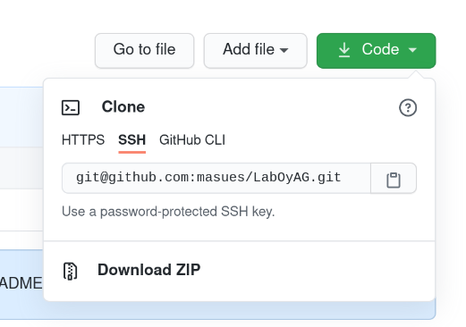
2. La ubicación en donde se clone el directorio es la que se ocupará para
compilar usando Quartus, por lo que su ruta debe ser sencilla sin caracteres
especiales tales como `_` o espacios.  
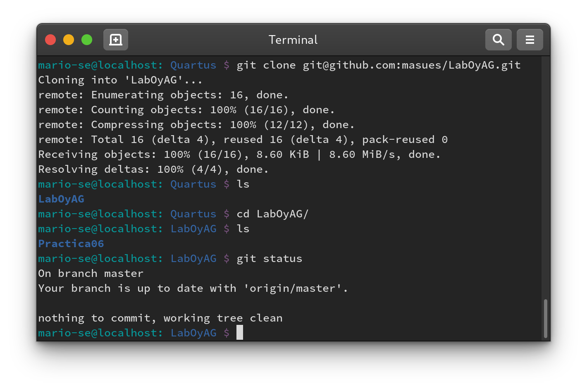
3. Abrir Quartus y crear un nuevo proyecto.  
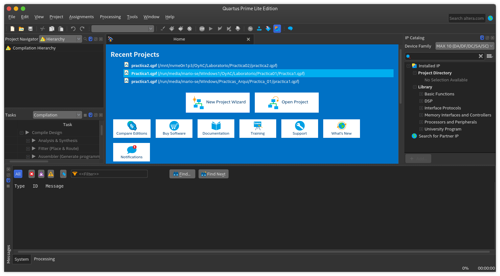
4. El proyecto variará dependiendo de la práctica que se esté realizando. En el
ejemplo se genera un proyecto para la práctica 06. Notar que este es un
subdirectorio del directorio raíz del repositorio de Git.    
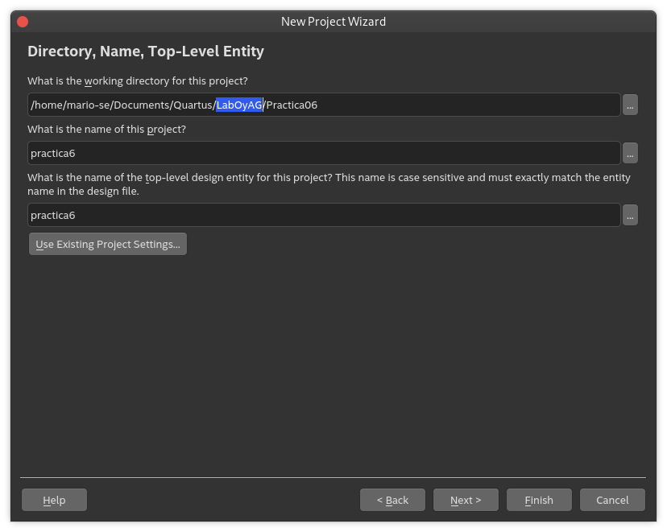
5. En la sección "Agregar archivos" dar clic en el botón con 3 puntos que se
muestra en la imagen.      
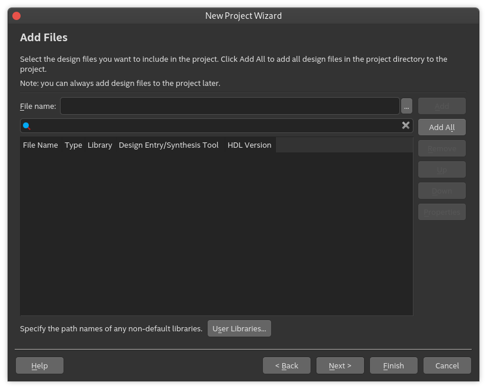
6. Notar que por defecto aparecen los archivos contenidos dentro del directorio seleccionado para el proyecto de Quartus. Seleccionar todos los archivos.  
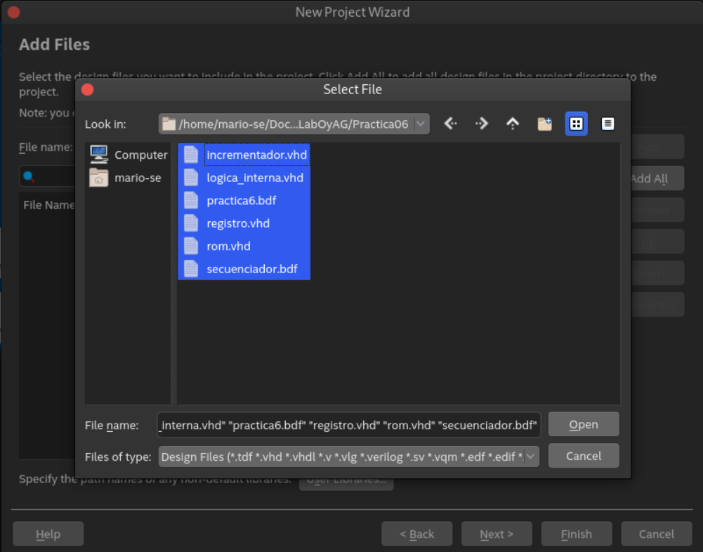
7. A continuación se selecciona a la FPGA sobre la que se trabajará. Para
cuestiones de simulación esta opción no afecta al proyeto.  
El código de la FPGA de la DE10Lite es: `10M50DAF484C7G`  
El código de la FPGA usada en el laboratorio de microcomputadoras es:
`EP4CE22F17C6N`.  
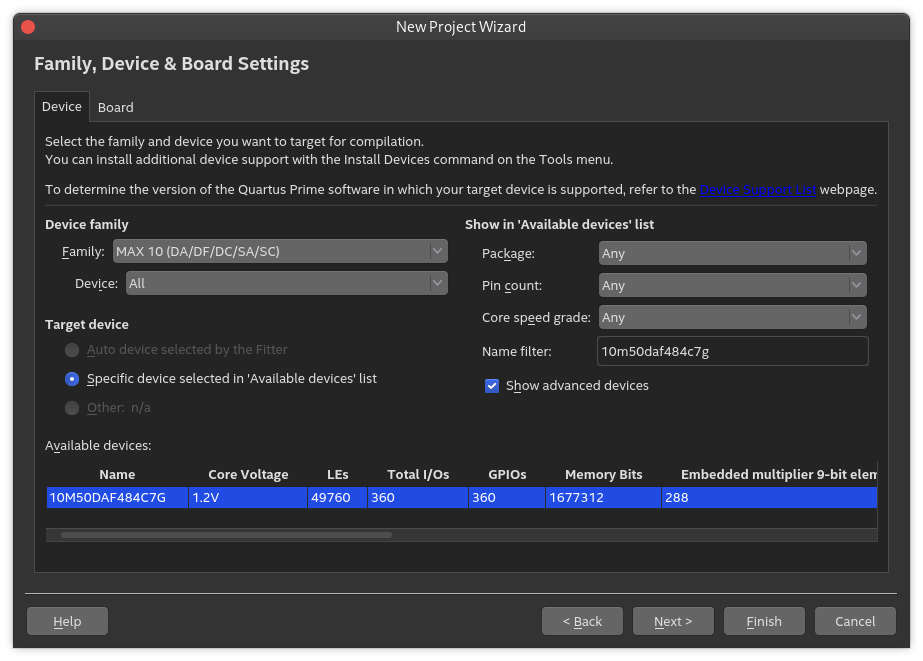
8. Seleccionar el simulador ModelSim-Altera y el formato VHDL.
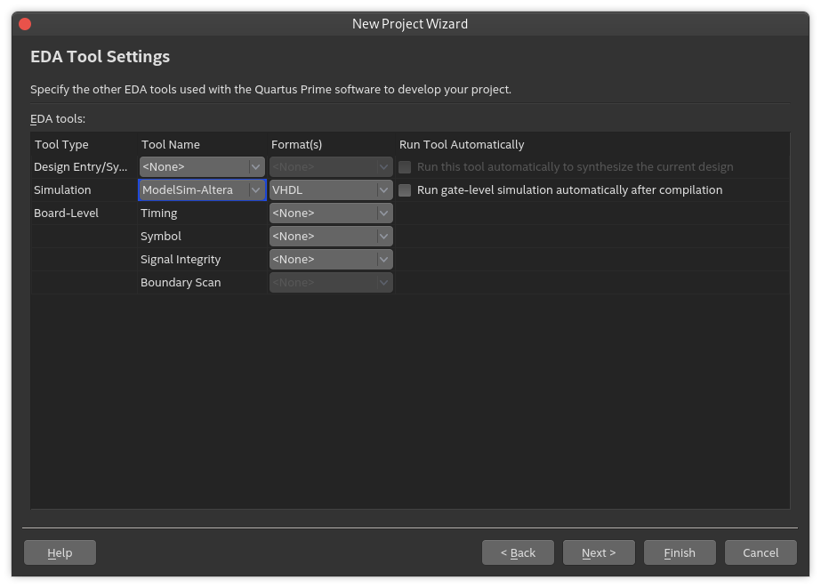  
9. Al finalizar, se debe poder visualizar todos los archivos de la práctica en
el proyecto de Quartus.
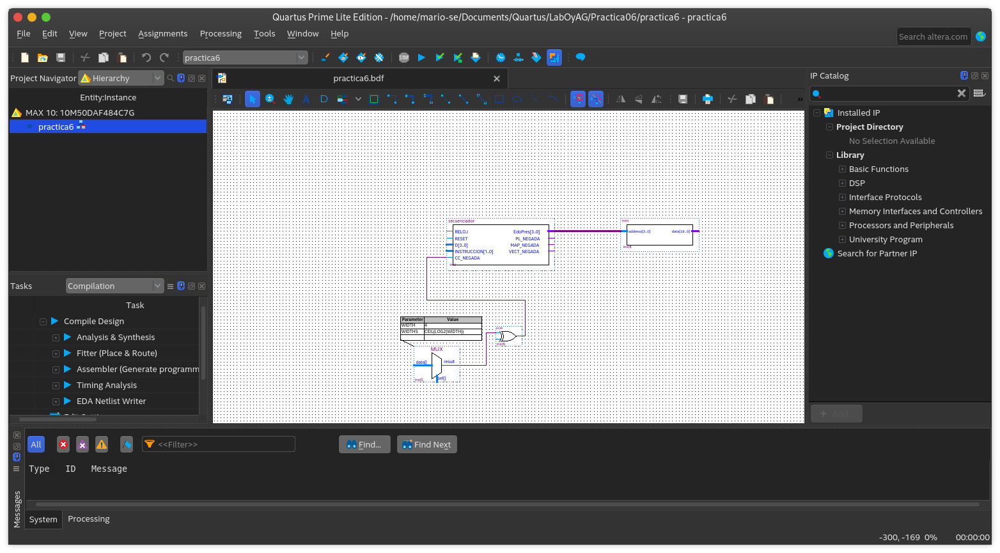  
10. PASO EXTRA  
En caso de que algún integrante haya agregado un archivo al repositorio de
GitHub posterior a la creación del proyecto de Quartus, será necesario agregarlo
a este último también.  
Para ello seleccionar la vista de archivos en *Project Navigator*, dar clic
derecho en *Files*, y a continuación *Add/Remove Files in Project*  
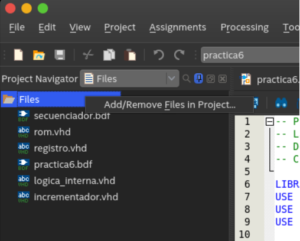
11. PASO EXTRA (continuación)  
Esto abre la siguiente ventana. Dar clic en el botón con 3 puntos.   
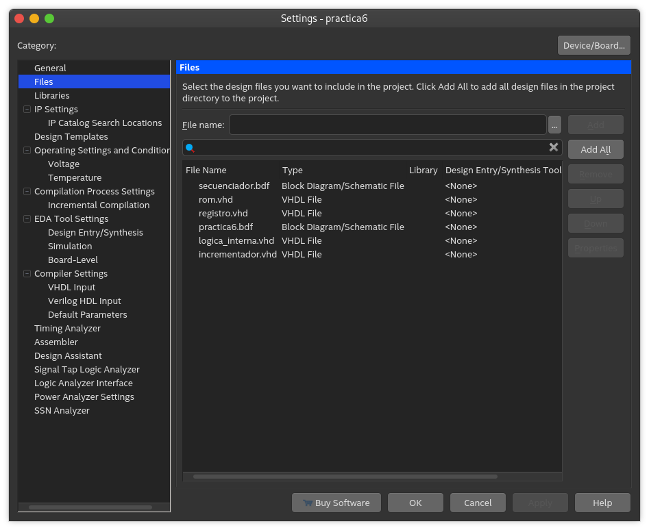  
12. PASO EXTRA (continuación)  
Este último paso abre un explorador en el que se encuentran todos los archivos
del directorio del proyecto. Agregar aquellos que sean necesarios.     
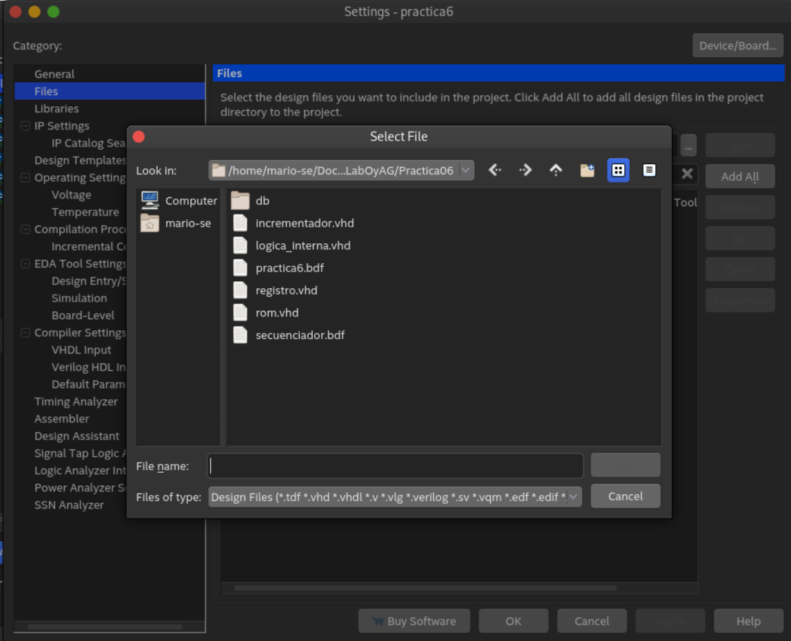  